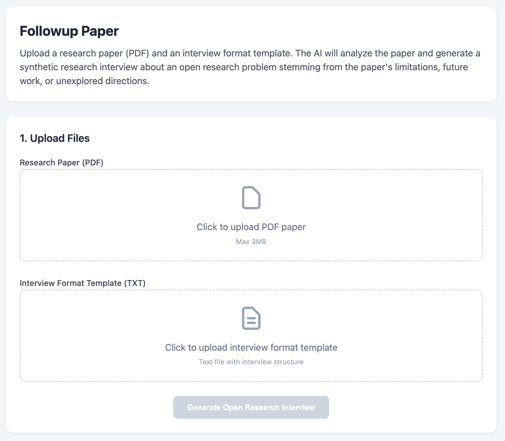
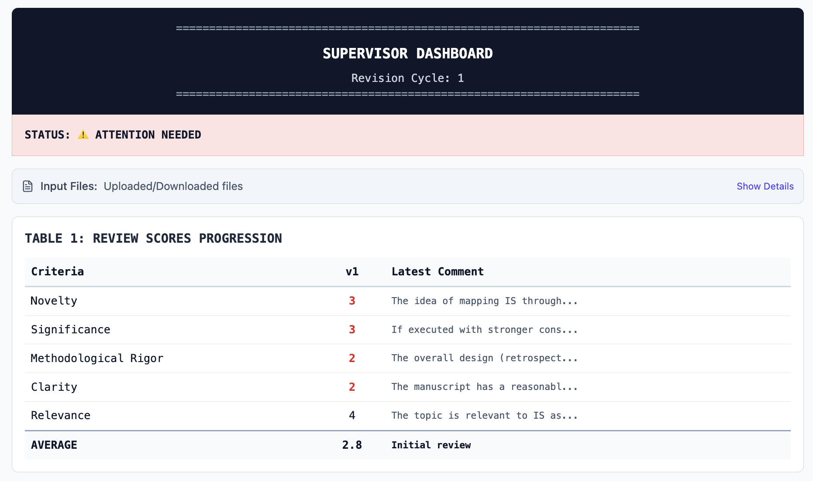
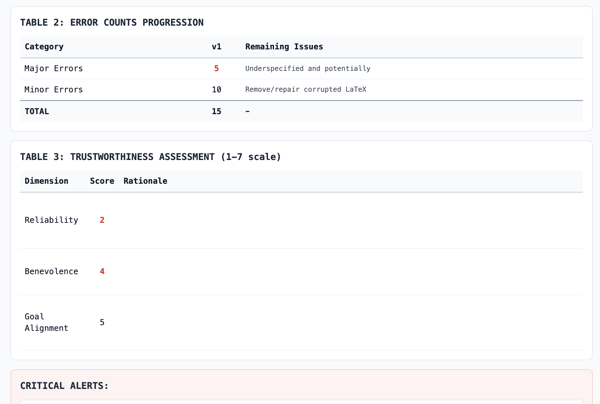
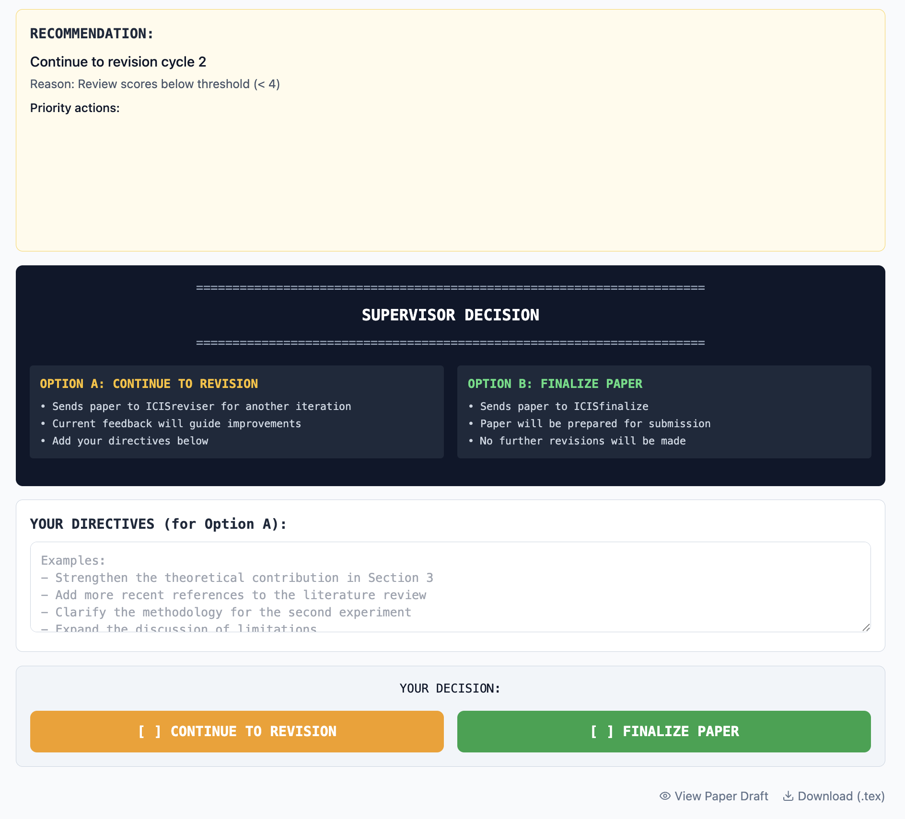
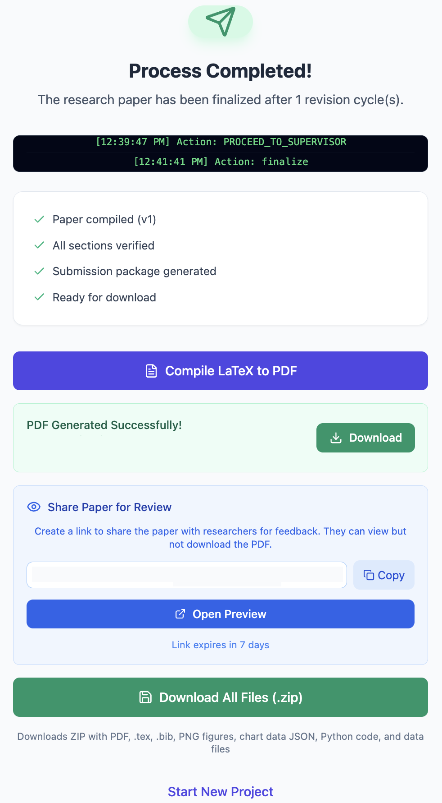

# ASD - Automated Scientific Discovery with Human Oversight

A React + TypeScript web application for AI-assisted academic paper generation with human oversight. Uses Gemini AI to transform research interviews into formatted conference papers while maintaining researcher control through a structured multi-stage workflow.

## References

**Designing human oversight in automated scientific discovery**
Dov Te'eni, Maayan Nakash, Iddo Drori
International Conference on Human-Computer Interaction, 2026

**Augmented research with meaningful human oversight**
Maayan Nakash, Dov Te'eni, Iddo Drori
Information Technologies and Systems: workshop on exploring generative AI to transform research, 2025

## Features

- **Multi-stage workflow**: Setup → Builder → Reviewer → Supervisor → Reviser → Finalize
- **AI-powered paper generation**: Uses Gemini AI to generate LaTeX papers from interview transcripts
- **Human oversight**: Supervisor stage for human review and approval
- **Data analysis**: Automatic statistical analysis and visualization generation
- **Reference validation**: Cross-references against Semantic Scholar
- **PDF generation**: Compiles LaTeX to PDF via cloud service

## Tech Stack

- **Frontend**: React 19, TypeScript, Vite
- **AI**: Google Gemini API, OpenAI API (secondary)
- **Backend**: Vercel Serverless Functions (25 endpoints)
- **Storage**: Vercel Blob, localStorage
- **Visualization**: QuickChart.io, Gemini image generation
- **PDF**: latex.ytotech.com compilation service

## Quick Start

```bash
# Install dependencies
npm install

# Set up environment variables
cp .env.example .env
# Edit .env with your API keys

# Run development server
npm run dev
```

## Scripts

| Command | Description |
|---------|-------------|
| `npm run dev` | Start development server |
| `npm run build` | Build for production |
| `npm run preview` | Preview production build |
| `npm run lint` | Run ESLint |
| `npm run format` | Format code with Prettier |
| `npm run test` | Run tests |

## Environment Variables

| Variable | Description |
|----------|-------------|
| `VITE_GEMINI_API_KEY` | Google Gemini API key |
| `GEMINI_API_KEY` | Server-side Gemini API key |
| `OPENAI_API_KEY` | OpenAI API key (optional) |
| `BLOB_READ_WRITE_TOKEN` | Vercel Blob storage token |

## Project Structure

```
├── api/                 # Vercel serverless functions (25 endpoints)
├── components/          # React components
│   ├── admin/          # Research admin dashboard
│   └── dashboard/      # Main stage components
├── services/           # Business logic
│   ├── geminiService.ts    # Gemini AI integration
│   ├── fileApi.ts          # Data analysis & charts
│   └── reviewerService.ts  # Review scoring
├── prompts/            # AI prompt templates
├── public/
│   ├── icis/           # ICIS conference assets
│   └── venues/         # Multi-venue configurations
└── types/              # TypeScript type definitions
```

## Screenshots

### Source and Target Selection


### Builder Stage


### Research Interview


### Followup Paper


### Supervisor Dashboard


### Errors Alerts


### Recommendation Supervisor Decision


### Completed


## License

MIT
